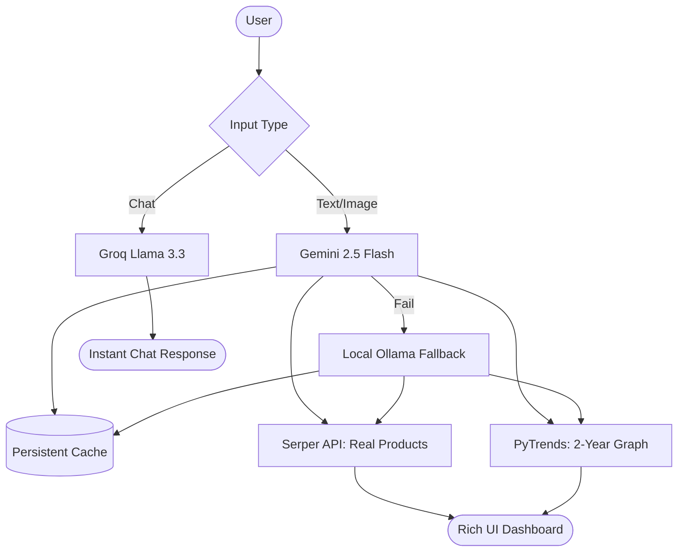

# FashAI: Professional AI Retail Trend Analyzer 🚀

FashAI is a state-of-the-art, production-ready SaaS platform designed for the Indian retail and fashion market. It combines multi-modal AI intelligence with real-time market data to provide actionable insights for retailers, designers, and fashion enthusiasts.


## 🌟 Key Features

- **Visual Intelligence**: Identify trends and products directly from images using **Gemini 2.5 Flash**.
- **Real-time Market Data**: Integrates with **Serper API** (Google Shopping) and **PyTrends** (Google Trends) for live pricing and popularity graphs.
- **Hybrid AI Fallback**: A resilient architecture that switches between **Gemini**, **Groq**, and **Local Ollama** models to ensure 100% uptime.
- **Ultra-Fast Performance**: Parallel API processing and multi-layer persistent caching for near-instant results.
- **Domain-Specific Chatbot**: A high-speed assistant powered by **Groq Llama 3.3**, strictly locked to the retail and fashion domain.
- **Persistent Memory**: Automatically saves analyses to disk (`ai_cache.json`) to save API costs and improve speed for repeat queries.

---

## 🛠️ Technology Stack

| Layer | Technologies |
| :--- | :--- |
| **Frontend** | React.js, Vite, Tailwind CSS, Chart.js, Lucide Icons |
| **Backend** | Python, FastAPI, Uvicorn, Asyncio |
| **AI Models** | Gemini 2.5 Flash, Groq (Llama 3.3), Ollama (Llama 3.2 & Moondream) |
| **Data APIs** | Serper Shopping API, Google Trends (PyTrends) |
| **Storage** | Persistent JSON-based Cache Files |

---

## 📐 System Architecture

FashAI uses a **Parallel Hybrid Flow** to maximize speed and reliability.



---

## 🚀 Getting Started

### 1. Prerequisites
- Python 3.9+
- Node.js & npm
- [Ollama](https://ollama.com/) (For local fallback support)

### 2. Environment Setup
Create a `.env` file in the `backend` directory:
```env
GEMINI_API_KEY_1=your_key_here
GEMINI_API_KEY_2=your_key_here
SERPER_API_KEY=your_key_here
GROQ_API_KEY=your_key_here
```

### 3. Installation
**Backend:**
```bash
cd backend
pip install -r requirements.txt
python main.py
```

**Frontend:**
```bash
cd frontend
npm install
npm run dev
```

---

## 📂 Project Structure

```text
├── backend/
│   ├── main.py            # FastAPI Application & AI Orchestration
│   ├── ai_cache.json      # Persistent Text Cache
│   ├── image_cache.json   # Persistent Vision Cache
│   └── .env               # API Configuration
├── frontend/
│   ├── src/
│   │   ├── App.jsx        # Dashboard Logic & UI
│   │   └── index.css      # Custom Styling
│   └── package.json
└── README.md
```

---

## 🛡️ Methodology

1.  **Redundancy**: The system uses two alternating Gemini keys to bypass rate limits.
2.  **Persistence**: Every image analyzed is hashed (MD5) and stored locally to prevent redundant API calls.
3.  **Domain Guarding**: Custom system prompts ensure the AI never hallucinates or discusses non-fashion topics.
4.  **Parallelism**: Frontend requests for AI and Graphs fire simultaneously to reduce TTFB (Time to First Byte).

---

## 📝 License
This project is licensed under the MIT License. Developed for professional retail intelligence.
